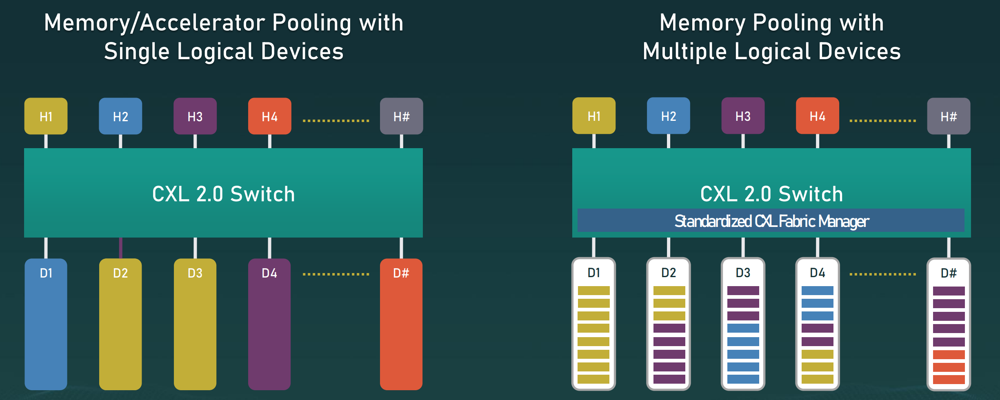

<!-- backgroundImage: url("../images/bg1.png") -->

<!-- _header: CXL技术调研报告 -->

# CXL技术调研报告
# 
## 一、CXL简要介绍与背景
## 二、CXL应用场景
## 三、CXL协议的演进
## 四、CXL子协议
## 五、CXL的发展
## 六、CXL未来展望

---

<!-- _header: CXL简要介绍 -->

**Compute Express Link (CXL)** 是一种较新的高速互联标准，旨在实现处理器和设备（加速器、内存缓冲区、敏捷互联网卡和固态存储等）之间的高速通信。 CXL提供一致性和内存语义，带宽基于PCIe，带宽可以与PCIe的带宽一致，同时实现比PCIe低的多的延迟。

CXL于2019年由Inter提出，并于2019年3月与阿里巴巴、思科、戴尔、谷歌、华为、Meta、Microsoft和HPE成立了CXL联盟。

---

<!-- _header: CXL要解决的挑战 -->
## 1. 对系统和设备内存的一致访问
##
## 2. 内存的可扩展性
##
## 3. 浪费资源和计算效率低下
##
## 4. 分布式系统中细粒度数据共享的延迟问题

---
<!--- _header: 对系统和设备内存的一致性访问 -->>
**挑战**：在传统架构中，系统内存通常通过DDR接口与CPU相连，并由CPU缓存层次结构进行缓存，而PCIe设备访问系统内存时通常是非一致性（non-coherent）的。这导致PCIe设备无法缓存系统内存，无法利用缓存的时间局部性或空间局部性，无法进行原子操作。而设备本地内存也无法映射到系统的可缓存地址空间。

---

<!--- _header: 内存的可扩展性 -->>

**挑战**：随着计算需求的指数级增长，内存带宽和容量的需求也在不断增加，但传统的DDR内存由于引脚效率低下，扩展成本高且带宽受限，无法满足这些需求。尤其是对于多服务器环境，增加DDR通道不仅提高了平台成本，还带来了信号完整性问题。

**CXL的解决方案**：CXL利用PCIe物理层的高引脚带宽扩展内存带宽和容量，通过CXL.memory协议支持内存扩展，允许使用不同类型的内存，并且可以通过CXL接口将这些内存连接到处理器，实现更高效的内存扩展。

---

<!--- _header: 浪费资源和计算效率低下 -->

**挑战**：在现代数据中心中，计算和内存资源往往是紧耦合的（tight coupling），每个服务器的资源只能供自己使用，导致资源利用率低。例如，当一个服务器的计算资源被完全利用时，可能还剩余大量未使用的内存，反之亦然。为了应对峰值需求，通常会为每个服务器过度配置资源，这导致了资源的浪费和效率低下。

**CXL的解决方案**：CXL通过引入资源池化机制（Resource Pooling），允许在多个服务器之间动态分配内存和其他资源。这样，未充分利用的资源可以在多个服务器之间共享，提高了数据中心的整体资源利用率，避免资源浪费。

---

<!--- _header: 分布式系统中细粒度数据共享的延迟问题 -->

**挑战**：在分布式系统中，工作负载往往需要进行细粒度的同步和数据共享，这些操作对延迟非常敏感，尤其是在更新较小数据块时。传统的网络延迟较高，无法满足这些场景的实时需求。

**CXL的解决方案**：CXL提供了一致性内存共享模型，支持多台主机之间的细粒度数据共享。通过CXL的低延迟互连，多个系统可以共享数据结构，执行同步操作或使用内存传递消息，这极大地降低了分布式系统中的通信延迟，提高了系统的响应速度。

---
<!-- _header: CXL应用场景 -->

---
<!-- _header: CXL协议的演进 -->

---
<!-- _header: CXL1.1内存拓展 -->
* CXL 给各种内存设备提供标准串行接口
* 远端内存与本地内存异步迭代: 远端内存可以是 DDR3/4/5, LPDDR3/4/5, 非易失内存等。
* 融合不同内存特点(persistence, latency, BW, endurance, etc)

---
<!-- _header: CXL2.0 switch -->
CXL2.0 支持single switch
#

---
<!-- _header: CXL2.0内存池化 -->
# 

---
<!-- _header: CXL2.0 持久化内存 -->

---
<!-- _header: CXL3.0特性 -->

#### CXL支持p2p交互的对等通信
* Virtual hierarchies are associations of devices that maintains a coherency domain
* P2P to HDM-DB memory is I/O Coherent: a new Unordered I/O (UIO) Flow in CXL.io – the Type-2/3 device that hosts the memory will generate a new Back-Invalidation flow (CXL.Mem) to the host to ensure coherency if there is a coherency conflic

---

<!-- _header: CXL3.0特性 -->

#
#
#
#### 每个主机都可以连接多种设备（最多16个CXL.cache设备）

#
#### 支持多级交换，允许多个CXL设备通过交换机连接，增强系统的可扩展性和灵活性。

---
<!-- _header: CXL3.0特性 -->

#
#### 设备内存可以被主机共享

#### 主机可以在主机缓存中拥有共享区域或共享区域部分的一致性副本

#### CXL 3.0 定义了在副本之间强制执行硬件缓存一致性的机制，确保在多主机或多设备访问共享资源时，缓存数据保持一致。

---
<!-- _header: CXL3.0特性 -->
#
#
#
#### 引入了CXL Fabric架构，支持构建更大规模的系统互连，允许更多设备和主机通过CXL Fabric进行互联。这有助于实现更复杂的拓扑结构，并显著提高系统的可扩展性。

---
<!-- _header: CXL3.1特性-->
## CXL Fabic Improvements/Extensions
* Scale out of CXL fabrics using PBR(Port Based Routing)
## Trusted-Execution-Enviroment Security Protocol(TSP)
* Allows for Virtualization-based, Trusted-Execution-Environments (TEEs) to host Confidential Computing workloads
## Memory Expander Improvements
* Up to 32-bit of meta-data and RAS capabiility enhancements

---

<!-- _header: CXL子协议 -->
CXL由三个协议组成，分别是**CXL.io、CXL.cache和CXL.memory**，它们在PCIe物理层上多路复用。

**CXL.io**协议基于PCIe。它用于设备发现、状态报告、虚拟到物理地址的转换以及直接内存访问（DMA）。

**CXL.cache**协议允许设备（如加速器、FPGA等）缓存主机内存，并与主机共享一致性缓存的语义。

**CXL.memory**协议使设备能够直接访问主机管理的设备内存（Host-Managed Device Memory, HDM），并允许处理器将设备内存映射为系统内存的一部分。

---

<!-- _header: CXL子协议 -->

---
<!-- _header: CXL设备 -->

---
<!-- _header: CXL应用实例 -->

CXL 生态系统需要 CPU 和设备支持。CXL 1.1 和 CXL 2.0 已部署在一些商业产品中，CXL 3.0 产品预计将在几年内问世。

英特尔支持在 Sapphire Rapids（SPR）CPU和Agilex7 FPGA 上开始的 CXL，支持所有三种协议。AMD在Genoa和Bergamo CPU 中支持 CXL，并已宣布支持SmartNIC设备，ARM已宣布在V2、N2和E2系列CPU中支持CXL 2.0。

三星构建了CXL1.1内存扩展设备，并公开分享了其基准测试结果。ontage、SK Hynix、Microchip、Micron和Astera Labs宣布推出 CXL Type3存储设备。美光已经设计了一种CXL1.1近内存计算设备的原型。

---
<!-- _header: CXL的未来方向-->
在**计算机体系结构**中，CXL允许独立开发内存控制器功能，如自适应DRAM刷新和低成本可靠性改进，推动更快的定制迭代。研究可能涉及内存延迟、缓存管理和预取策略的优化。

在**计算机系统**中，CXL内存池化将改变本地和分布式内存管理，需应对内存压力、网络拥塞和QoS的挑战。

在**计算机工程**中，研究重点是降低CXL内存和加速器的延迟，同时改进错误管理，并通过UCIe支持跨机架的可组合系统，提升性能和降低成本。

---
